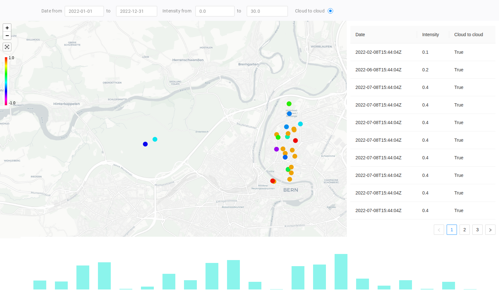

# frontend-coding-challenge

> a frontend coding challenge

The following is a frontend coding challenge. In summary, the goal is to implement a web application that allows to interactively explore lightning data (see Figure 1). In summary, its features are:

- F1: Given the current map view extent and a date range it loads the according lightning data from a mocked REST API.

- F2: Displays lightning data on a map, in a table, and a histogram chart, that displays the number of lightnings per sensible aggregation time-period.

- F3: In addition to viewing lightning data by map view extent and date range, one can also select the visible lightning data by intensity range and if it was a cloud-to-cloud lightning.

- F4: The lightnings are displayed on the map as points. The points are thematically colored by lightning intensity.

- F5: Finally, if one or multiple lightnings are selected in either the map, the table, or the chart the corresponding lightnings should be highlighted in the other two views (e.g. for a rectangle region selection in the map, corresponding rows are highlighted in the table, while for the chart the entire histogram bucket is highlighted).

Figure 1: How the application should approximately look like.

### Specification

In addition to the above feature overview, the following points specify some essentials of the application. Please note, that this is purposely not a full software requirements specification (SRS) and hence, any underspecified aspects SHOULD be implemented according to the candidate's recommendation. Finally, the keywords to indicate requirement levels are defined [here](https://datatracker.ietf.org/doc/html/rfc2119).

- S1: The application MUST be implemented using the following software stack:

    - [React](https://reactjs.org/): Frontendframework.

    - [Vite](https://vitejs.dev/): Bundler.

    - [Leaflet](https://leafletjs.com/) via [React Leaflet](https://react-leaflet.js.org/): Map.

    - [PlotlyJS](https://plotly.com/javascript/) via [React PlotyJS](https://plotly.com/javascript/react/): Chart.

- S2: The application MAY use [Redux Toolkit](https://redux-toolkit.js.org/) for state management.

- S3: The application MAY use other libraries if sensible and the reason for their usage is documented as part of the solution.

- S4: For mocking the REST API call (e.g. api/v1.0/events?lat=47&lon=7&radius=100&datetimeStart=2000-06-15T12:12:32Z&datetimeEnd=2022-06-15T12:13:32Z) the data.geojson MUST be used. It can be found [here](data.geojson).

- S5: The features F1, F2, F3, and F4 SHOULD be implemented. F5 MAY be omitted from the implementation.

- S6: The application SHOULD be implemented according to Figure 1. The design MAY differ.

- S7: Implementation SHOULD follow software engineering best practices.

- S8: The duration of the implementation SHOULD take no longer than (1-)2 days. If (1-)2 days have passed work should be stopped. Partial implementation is acceptable.

- S9: All deviations from the specification MUST be documented as part of the solution.

- S10: The implementation MUST be submitted as a merge request to the master branch.

### Remarks

- If questions arise, the contact from Meteotest AG may be asked.